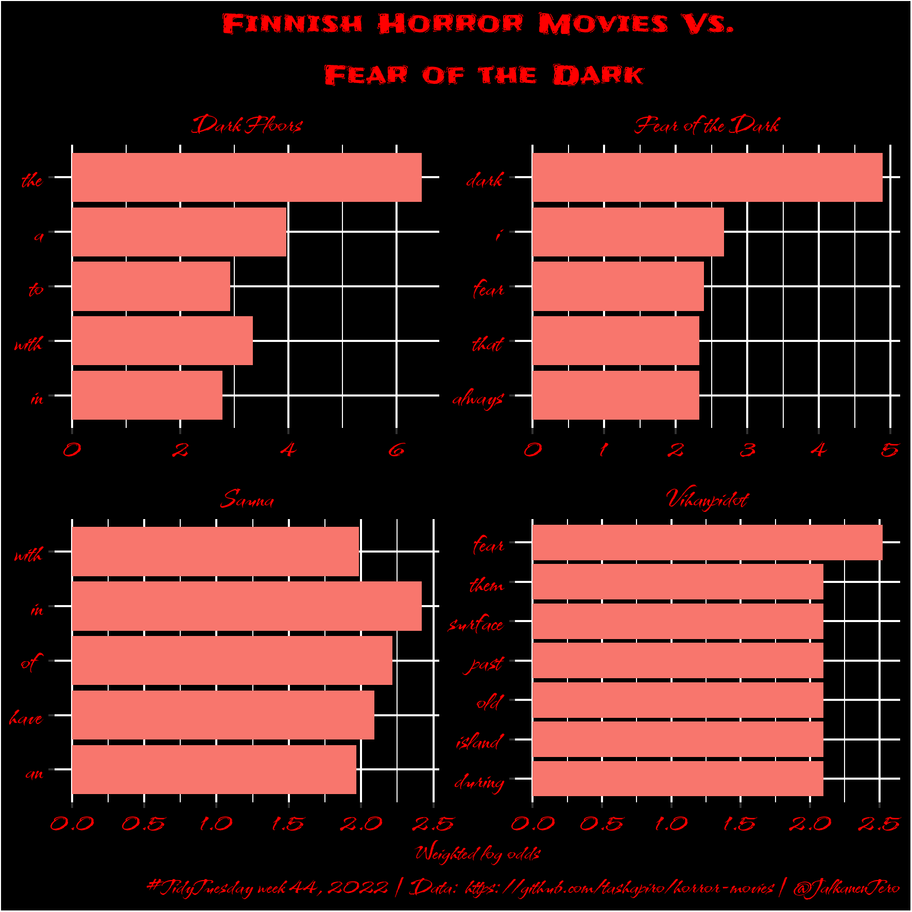

# Week 44 - Horror movies

> Purpose is to explore a dataset about horror movies dating back to the 1950s. Data set was extracted from **[The Movie Datbase](https://www.themoviedb.org)** via the tmdb API using R <code>httr</code>. There are ~35K movie records in this dataset.

Read more about Tanya's workshop on her GitHub: [Horror Movies](https://github.com/tashapiro/horror-movies)

