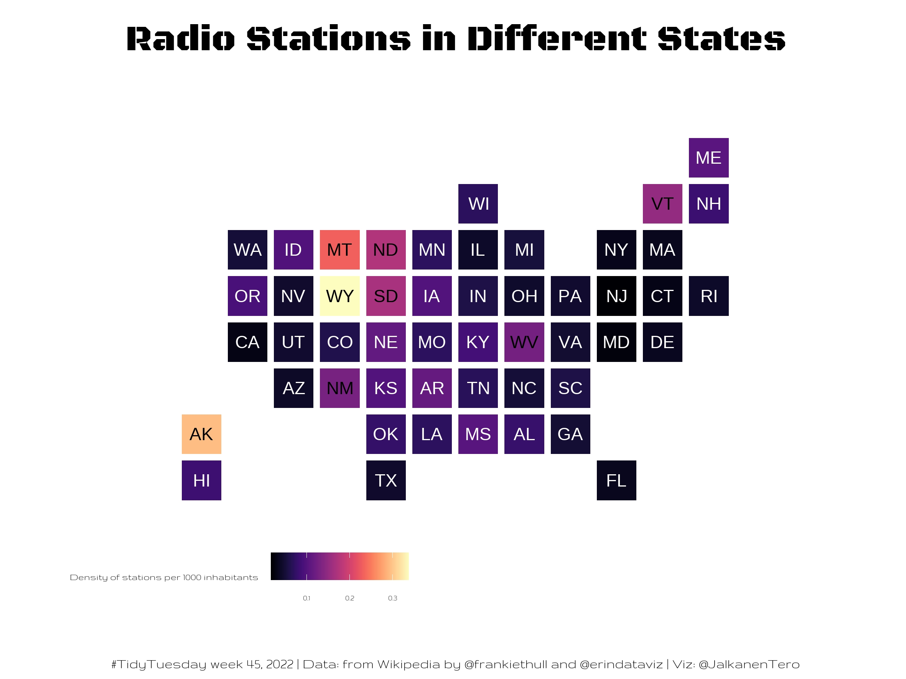

# Week 45 - Radio Stations

The data this week comes from [Wikipedia](https://en.wikipedia.org/wiki/Lists_of_radio_stations_in_the_United_States). 

The dataset included was mined from all 50 states, tidying column names, binding and aggregating. 

[Erin's](https://twitter.com/erindataviz) blogpost on [Visualizing the Geography of FM Radio](https://erdavis.com/2020/01/04/visualizing-the-geography-of-fm-radio/). Data sourced from [FCC](https://www.fcc.gov/media/radio/fm-service-contour-data-points).

Credit: [Frank Hull](twitter.com/frankiethull) and [Erin](https://twitter.com/erindataviz)

## Density of radio stations

This week I made my first ever cartogram, which shows the amount of radio stations per 1000 inhabitants in different US states.
I took the population of different states from Wikipedia.

